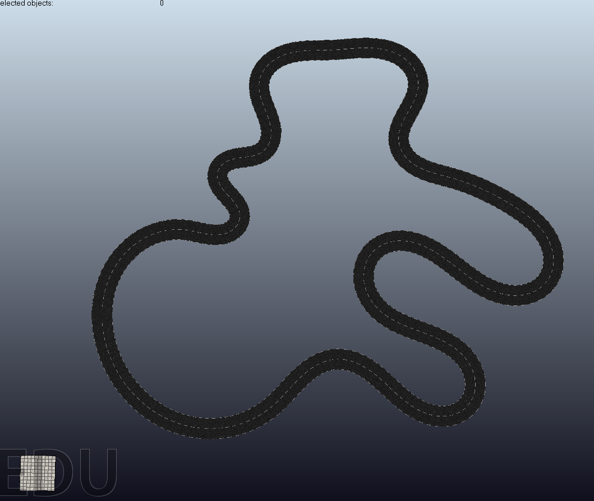

model_generation
================

### Dependencies
* `numpy==1.15.4`
* `svgpathtools`
* `pathlib`
* `ruamel.yaml`
* `pandas`
* [`lanelet2`](https://github.com/yuzhangbit/lanelet2_standalone)


### Setup for Blender

* See [blender setup](docs/blender_setup.md) for details.
* Follow the [instruction](https://github.com/yuzhangbit/lanelet2_standalone) to install lanelet2 for the blender.
  In the [installing step](https://github.com/yuzhangbit/lanelet2_standalone#installing), replace the python with the bundled python from blender to install lanelet2 in the `lanelet2_standalone` directory:
  ```bash
  /path/to/blender-2.78c/2.78/python/bin/python3.5m setup.py install
  ```

Usage
-----
1.Add blender to ~/.bashrc
```bash
alias blender=/path_to_your_blender_install_directory/blender
```
then
`source ~/.bashrc`

2.Run the script by launching blender in the background
```bash
blender --background --python model_generation.py
# or
blender -b -P model_generation.py
```

You will get an `obj` file named `road.obj` with `mtl` and texture images in `generated` directory.

3.Import the obj model in VREP. 

Create Your Own Track Models
-----
Please see [docs/how_to_generate_a_track_model](docs/how_to_generate_a_track.md) for details.
