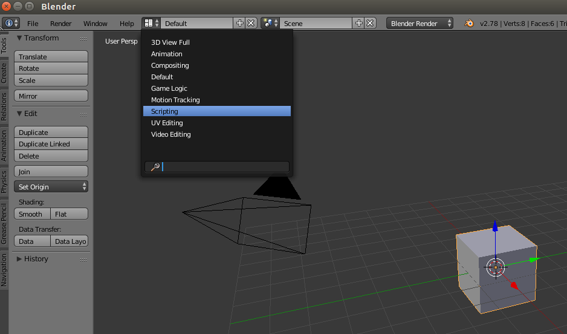
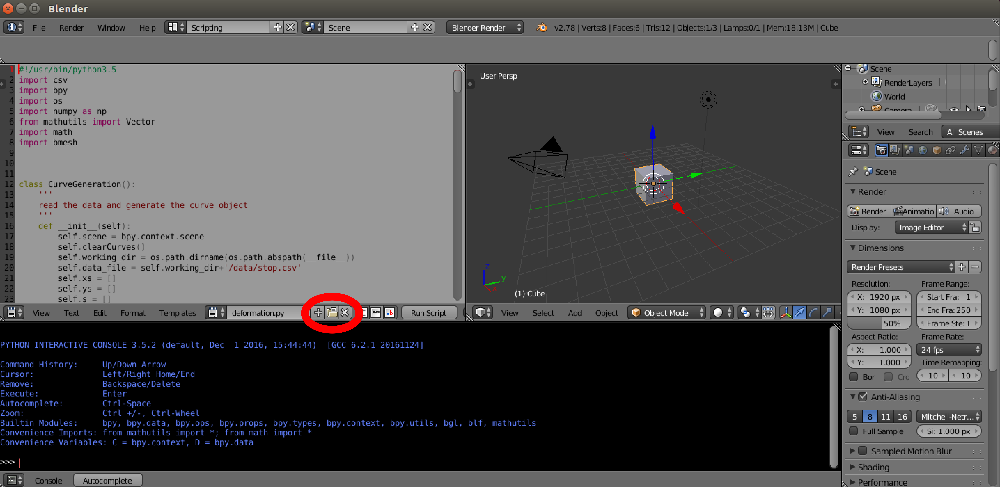

# Blender Setup
Tested version:
* Version: 2.78c
* Bundled Python Version: python3.5

## Setup
1. Download Blender-2.78c
2. Enable pip for Blender
  ```bash
  cd blender-2.78c/2.78/python
  bin/python3.5m lib/python3.5/ensurepip
  ```
3. Now you can use pip3 to install python packages such as `pandas`,`svgpathtools`,`scipy` for blender by
  ```bash
  cd /path/to/blender-2.78c/2.78/python/bin
  ./pip3 uninstall numpy # remove the latest numpy
  ./pip3 install numpy==1.15.4
  ./pip3 install pandas svgpathtools pathlib ruamel.yaml
  ```
  If you get errors below, it means that you have changed the path to your blender. `pip3` can't find where the `python3.5m` is.
  ```bash
 /home/user/Desktop/blender-2.78c/2.78/python/bin/python3.5m: bad interpreter: No such file or directory
  ```
  you should update your pip by
  ```bash
  curl https://bootstrap.pypa.io/get-pip.py -o get-pip.py
  /path/to/your/blender-2.78c/2.78/python/bin/python3.5m get-pip.py
  ```
4. For convenience, you can define aliases for the `blender`, `bundled python` and corresponding `pip` in `~/.bashrc`:
  ```bash
  alias blender='/path/to/blender-2.78c/blender'
  alias bpython='/path/to/blender-2.78c/2.78/python/bin/python3.5m'
  alias bpip='/path/to/blender-2.78c/2.78/python/bin/pip3'
  ```
  then
  ```
  source ~/.bashrc
  ```
5. Execuate python scripts using the bundled python interpreter
  ```bash
  touch test.py && echo 'print("It is working!")' > test.py
  bpython test.py
  ```
6. Execuate python scripts with the Blender engine in the background
  ```bash
  blender -b -P test.py  # -b background mode, -P python scripts
  ```
  In `test.py` file, you can call python module from blenders or third-party modules like this
  ```bash
  # blender python module
  import bpy
  import bmesh
  # third-party python module
  import pandas
  import svgpathtools
  ```
7. Test python scripts in blender with UIs.
    * Launch blender by `blender` in terminal
    * Choose the `scripting` view
    
    * Load the python script
    
    * Click `Run Script` to test the scripts, and the debug information will show in terminal.

## Trouble-shooting
* **numpy errors with blender**:
  The latest numpy==1.16.0 has import errors as below with the bundled python.
  ```
  >>> import numpy
  Traceback (most recent call last):
    File "<stdin>", line 1, in <module>
    File "/home/user/Desktop/blender-2.78c/2.78/python/lib/python3.5/site-packages/numpy/__init__.py", line 142, in <module>
      from . import core
    File "/home/user/Desktop/blender-2.78c/2.78/python/lib/python3.5/site-packages/numpy/core/__init__.py", line 57, in <module>
      from . import numerictypes as nt
    File "/home/user/Desktop/blender-2.78c/2.78/python/lib/python3.5/site-packages/numpy/core/numerictypes.py", line 111, in <module>
      from ._type_aliases import (
    File "/home/user/Desktop/blender-2.78c/2.78/python/lib/python3.5/site-packages/numpy/core/_type_aliases.py", line 63, in <module>
      _concrete_types = {v.type for k, v in _concrete_typeinfo.items()}
    File "/home/user/Desktop/blender-2.78c/2.78/python/lib/python3.5/site-packages/numpy/core/_type_aliases.py", line 63, in <setcomp>
      _concrete_types = {v.type for k, v in _concrete_typeinfo.items()}
  AttributeError: 'tuple' object has no attribute 'type'
  ```
**Solution**:
```
bpython bpip uninstall numpy
bpython bpip install numpy==1.15.4
```
