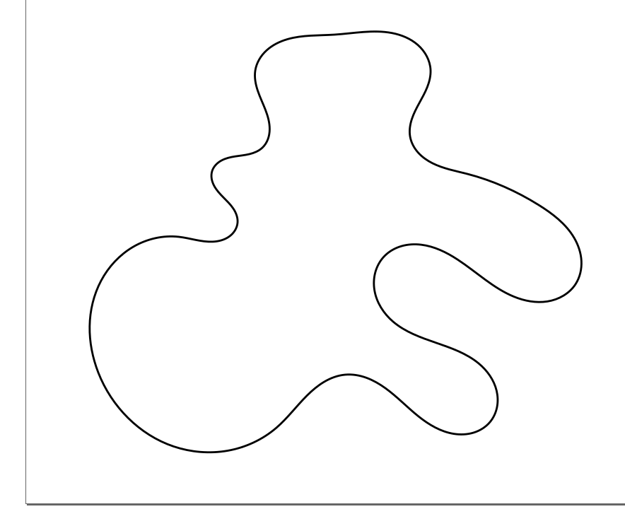
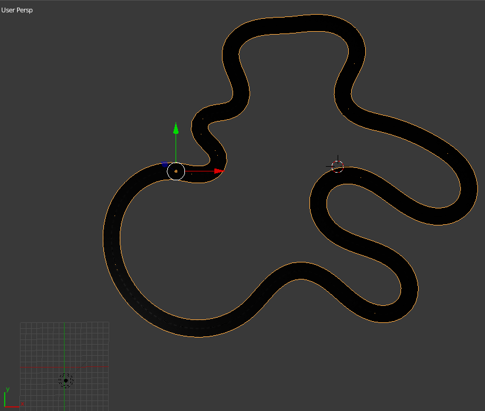
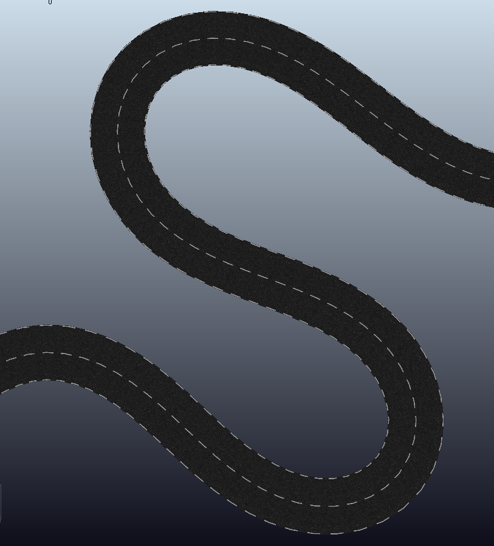

## Model Generation
In order to ease the model generation process, we leverage the power of inkscape and blender. Use inkscape as a user interface to create the center line of the track and blender for model generations and texture mapping.

## Unit Convention
* Inkscape   
To gain the best user experience, we use `mm` (millimeter) as the default unit for drawing. By doing this, you get the best view and a good sense how big your track is going to be according to the rulers in inkscape. This `mm` will be interpreted as `m` (meter) in blender and vrep.

## Frame Definitions


* The svg path data is represented in the `viexBox` frame. To get the real physics coordinates, you need   
`x_real = x_svg`,   
`y_real = viexBox_height - y_svg`  
This has been handled by our python scripts.

## Steps
* Use inkscape to draw a smooth curve and save it as a svg file to the `data` directory:

* Run our script with blender in the background to generate a wavefront file (.obj) with textures to the `generated` directory:
```
blender -b -P model_generation.py
```

* Load the `obj` files in vrep: import mesh
  * In texture load options, select `Scale texture to max. 512x512`.
  * In mesh scaling, select `1 unit represents 1 meter`.
  * In mesh orientation, select `Y vector is up`.       


